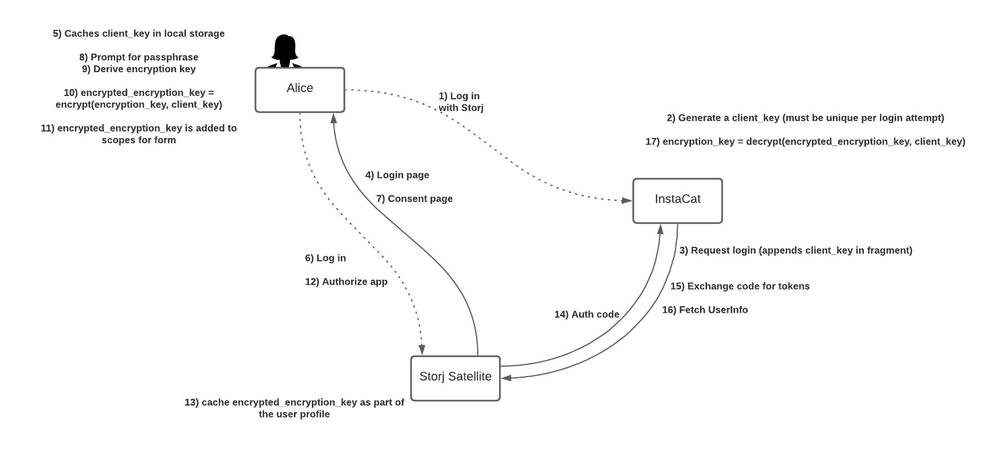

# OAuth / OIDC Cubbyhole

Share secret data between client applications.

This is mostly a demonstration of the work I've been evaluating at Storj. It shows how we can securely pass data from 
the client side of an OpenID Connect Identity Provider to a client application without the identity provider being
exposed to the content in the cubbyhole (such as a passphrase or encryption key).

## The gist



- A client, registered with the OpenID Connect Identity Provider, passes along an AES encryption key as part of the
  URL fragment (`/oauth/authorize?client_id=&scope=&state=&redirect_url=#key`).
- The Identity Provider caches the fragment in local storage before redirecting the user to login.
- After logging in, the user is presented with a consent screen where they can enter a plaintext value for their cubbyhole.
- Using the key from the fragment, the browser can encrypt the cubbyhole value before sending it to the server.
- After being authorized access, the application calls to obtain the users informati*on.
  - In addition to the standard user information in OIDC, the call can return the encrypted cubbyhole value.

A few items to note:

- The identity provider SHOULD be implemented using a single page app (like React or Vue)
  - Otherwise, the server may trigger a redirect and wipe the encryption key from the fragment
- The OAuth workflow starts on the consent page. The encryption key and app info (client_id, etc) needs to be cached on
  that page before redirecting.
  - This is often done on the server as part of the user session.*

## Running the code

1. Run the server
   ```
   npm install -g @vue/cli
   go generate ./...
   go run ./cmd/server/main.go
   ```

2. Run the client
   ```
   go run ./cmd/client/main.go
   ```

3. Open http://localhost:9090/login in your browser.

4. Login with `test` and `test`

5. There aren't any requirements for the consent page, enter whatever data you like.
